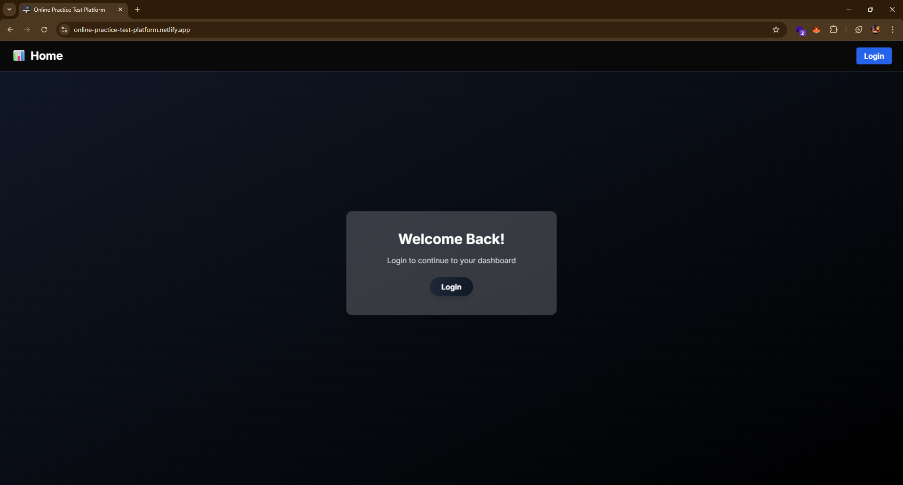
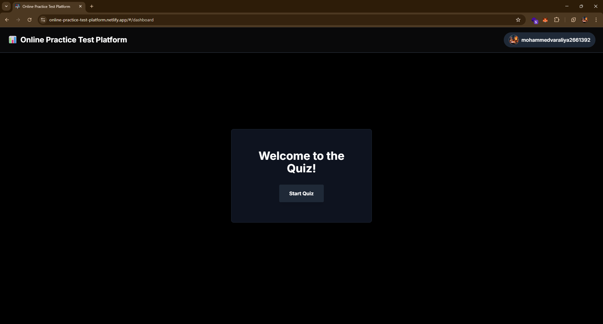
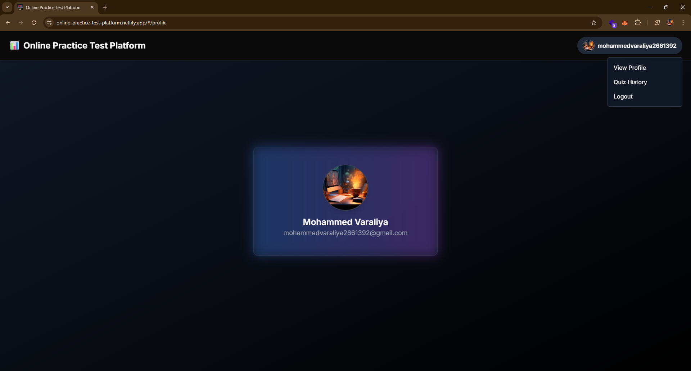
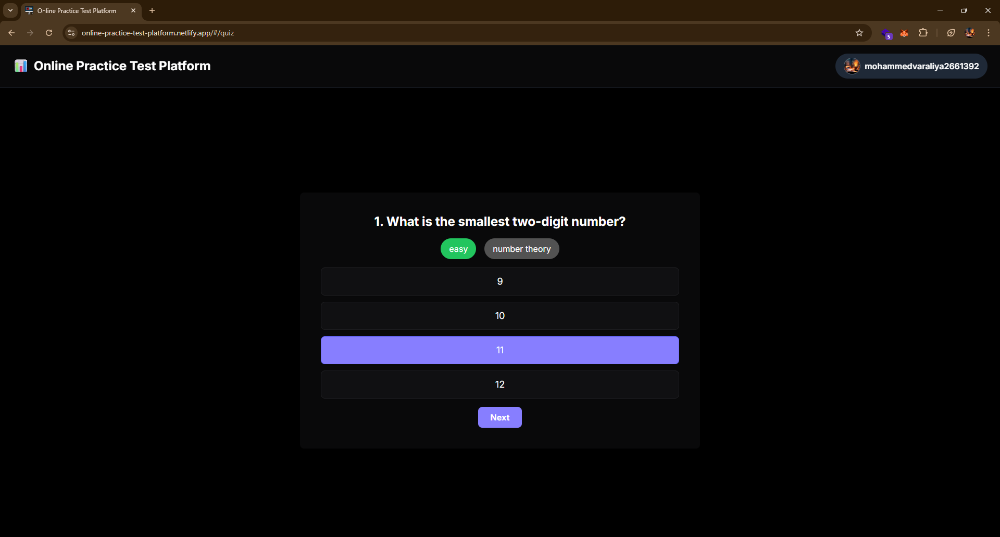
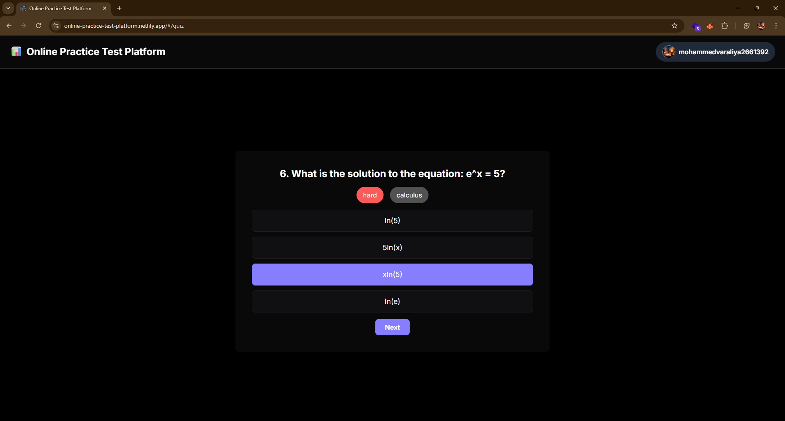
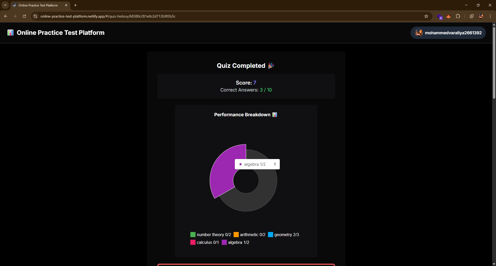
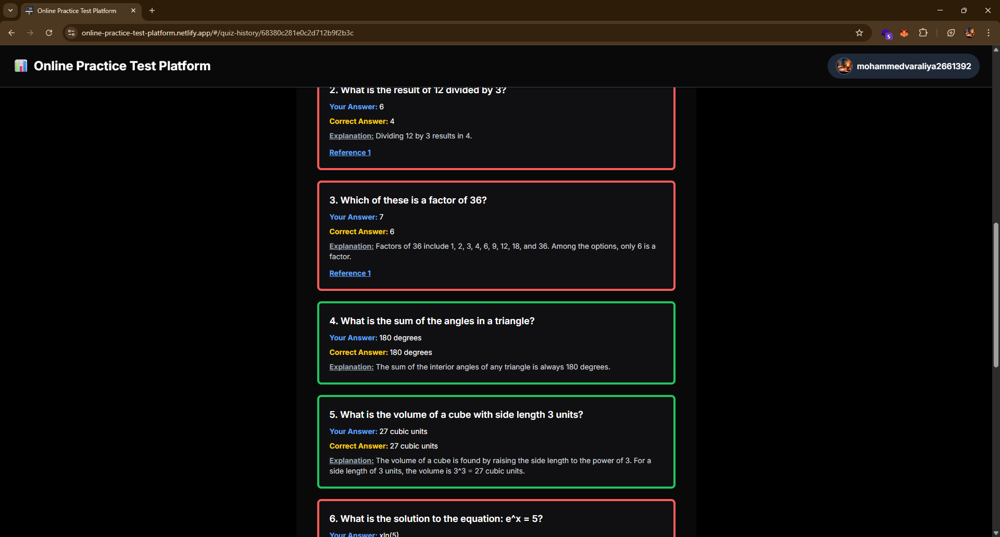
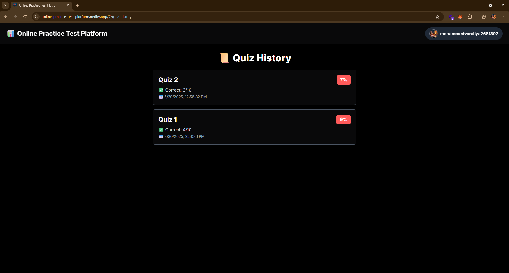

# **Online Practice Test Platform**

🚀 **Live Application:** [Online Practice Test Platform](https://online-practice-test-platform.netlify.app/)

---

## **Overview**

The **Online Practice Test Platform** is a responsive and intelligent web application offering a personalized quiz experience through **Computerized Adaptive Testing (CAT)**. Built with the **MERN stack (MongoDB, Express.js, React, Node.js)**, the platform dynamically adapts question difficulty in real-time based on user performance, ensuring a tailored and effective learning process.

The application also features **Google Auth0** authentication, a user-specific dashboard, detailed performance reports, and seamless data handling via a robust REST API.

---

## **Features**

### 🔐 **User Authentication**

- Secure sign-in using **Google Auth0**.
- On successful login, user information is persisted in **MongoDB** for personalized access.

### 🧑‍💻 **User Dashboard**

- Post-authentication, users are directed to a personal **dashboard** where they can:

  - Initiate new quizzes.
  - Access historical quiz performance.

### 🧠 **Computerized Adaptive Testing (CAT)**

- Each quiz consists of **10 multiple-choice questions**.
- Question difficulty (easy, medium, hard) is dynamically adjusted based on the user's response history.
- **Scoring System:**

  - Easy: 2 points
  - Medium: 3 points
  - Hard: 4 points

### 📊 **Results & Analytics**

- Users receive a **comprehensive result report** post-quiz, including:

  - Total score and number of correct answers
  - **Pie chart visualizations** for category-wise performance
  - Detailed **explanations and references** for incorrect answers

### 🧩 **Database & API Architecture**

- **MongoDB Atlas** is used for storing user data and quiz histories.
- RESTful API endpoints handle:

  - Quiz generation
  - Quiz history storage
  - Retrieval of past results

---

## **Technology Stack**

| Component           | Technology Used            |
| ------------------- | -------------------------- |
| Frontend            | React (Vite), Tailwind CSS |
| Backend             | Node.js, Express.js        |
| Database            | MongoDB (Atlas)            |
| Authentication      | Google Auth0               |
| Frontend Deployment | Netlify                    |
| Backend Deployment  | Render                     |

---

## **Data Structure: Sample Question Format**

```json
[
  {
    "id": 1,
    "question": "-67 x (-1) = ?",
    "options": ["-1", "-67", "67", "1"],
    "correct_answer": "67",
    "difficulty": "easy",
    "tags": ["arithmetic"],
    "explanation": "Multiplying any number by -1 changes its sign. Here, -67 multiplied by -1 results in 67.",
    "references": ["https://www.mathsisfun.com/numbers/multiplication.html"]
  }
]
```

---

## **Adaptive Testing Logic (CAT)**

The system dynamically selects questions based on performance using the following logic:

- ✅ **Correct Answer** → Increase difficulty
- ❌ **Incorrect Answer** → Decrease difficulty

### 📈 Difficulty Flow:

| Current | If Correct | If Incorrect |
| ------- | ---------- | ------------ |
| Easy    | Medium     | Easy         |
| Medium  | Hard       | Easy         |
| Hard    | Hard       | Medium       |

---

## **Backend API Overview**

The backend architecture provides clear and modular RESTful endpoints:

| Method | Endpoint                    | Description                         |
| ------ | --------------------------- | ----------------------------------- |
| POST   | `/api/auth/login`           | Authenticates user via Google Auth0 |
| POST   | `/api/quiz/start`           | Dynamically fetches quiz questions  |
| POST   | `/api/quiz/save-history`    | Saves user quiz history             |
| GET    | `/api/quiz/history/:userId` | Retrieves past quiz performance     |

---

## **Deployment**

- 🌐 **Frontend**: [Deployed on Netlify](https://online-practice-test-platform.netlify.app/)
- ⚙️ **Backend**: Deployed on **Render**

---

## 📷 **Application Snapshots**

The following table showcases various stages and features of the platform:

| Screen Title                | Image Preview                                                                 | Alt Description                              |
| --------------------------- | ----------------------------------------------------------------------------- | -------------------------------------------- |
| Login via Google            |                    | Google Auth0 login screen                    |
| Welcome Screen              |       | Initial landing page after login             |
| User Profile Dashboard      |                | User dashboard displaying profile info       |
| Quiz Start – Easy Level     |      | First quiz question with easy difficulty     |
| Quiz Progress – Hard Level  |      | Advanced question based on prior performance |
| Result Analysis - Summary   |  | Summary of quiz results and total score      |
| Result Analysis - Pie Chart |  | Category-wise performance chart              |
| Result Analysis - Review    |  | Review of answers with explanations          |
| Quiz History Overview       |           | Historical records of past quizzes           |

---

🚀 **Try it Now:** [Launch the App](https://online-practice-test-platform.netlify.app/)

📧 For feedback, suggestions, or contributions, feel free to open an issue or submit a pull request.

---
